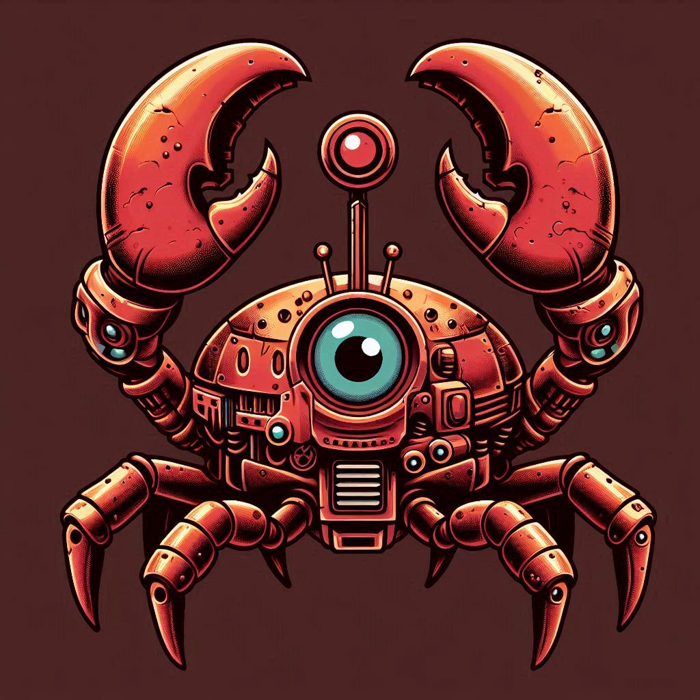

# Ferrisbot

<p align="center"></p>

## What is this?

Ferrisbot is a Rust based chat bot, designed to used with Telegram messenger.

## Setup LLM

### Install Ollama

Download and install Ollama

[Download URL](https://ollama.com/download)

### setup LLM modell

**examples:**

Llama3.2

```bash
ollama run llama3.2:latest
```

or

mistral-nemo 12B

```bash
ollama run mistral-nemo:12b
```

**Remember: The models must have _tool_ support and if it works well or not depends on the model of your choice!**

## Setup Telegram token & parameters

**examples:**

```bash
export TELEGRAM_TOKEN = <MY_TELEGRAM_BOT_TOKEN>
export OLLAMA_HOST_ADDR = "http:localhost"
export OLLAMA_PORT = 11434
export LLM_MODEL = "llama3.2:latest"
export BOT_NAME = "Eve"
export BOT_USERNAME = "ModeratorBot"
```

## Define Bot Task

create or adjust the bot role definition as enumerations (natural language) in the prompt template role_definition.md

### Template Placeholder

Following placeholders must be used in your role definition prompt template

#### Botname 

replace with the name of your bot which was given:

```bash
{name}
```

#### No action flag

This internal flag is important when you define a situation in the template where the bot should not response to a message:

```bash
 {NO_ACTION}
```

## Setup local development

### External Dependencies

This crate requires OpenSSL and `pkg-config`:

- On Linux: `pkg-config libssl-dev`
- On Mac: nothing to do!

### Build the project

```bash
cargo install
cargo build
```

### Run

```bash
cargo run
```

### Notes

- For the Telegram api framework, I'm using my own fork version of [mobot](https://github.com/slaytanic87/mobot), where the missing telegram api capabilities are implemented: Restriction of chat members, forum message support, retrieve chat full information, ban/unban users and get administrator member list.
When the features are fully tested and the time allows me, I will create a PR to contribute back if they want.
